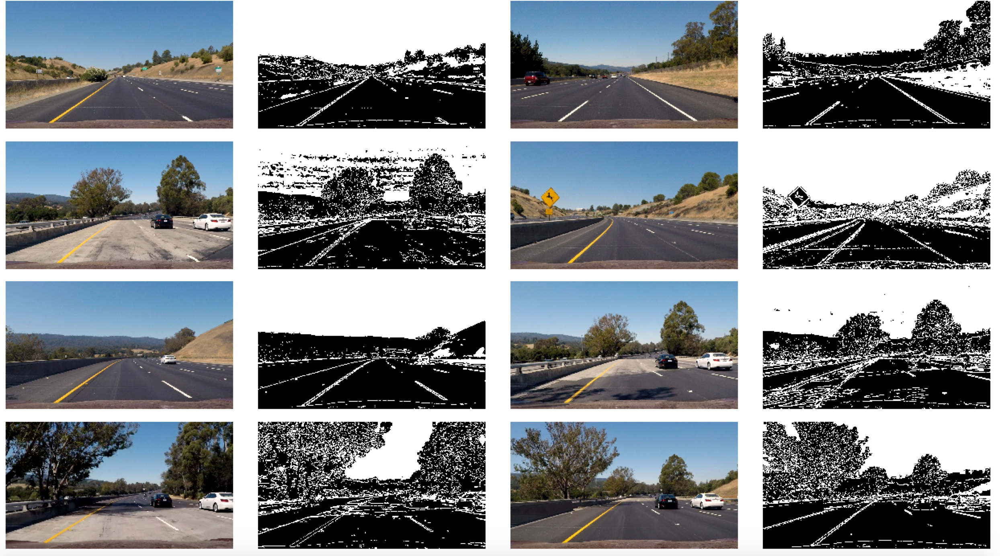
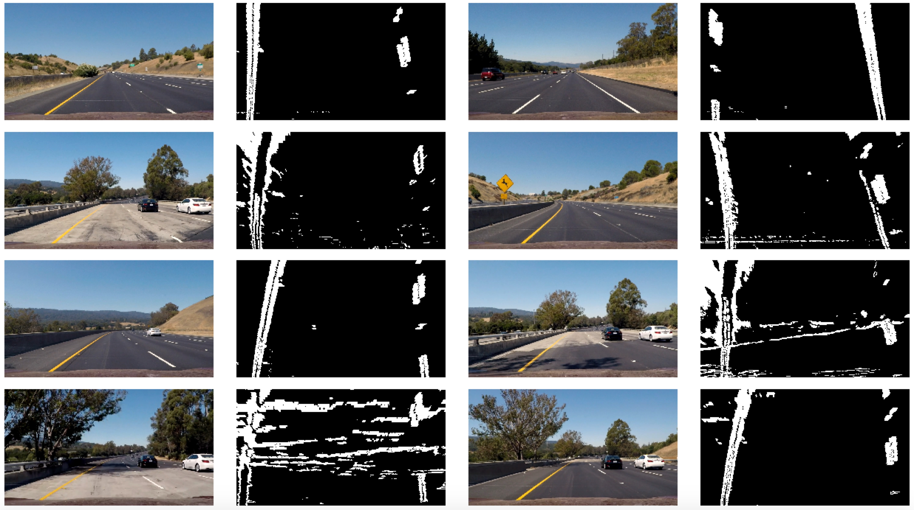
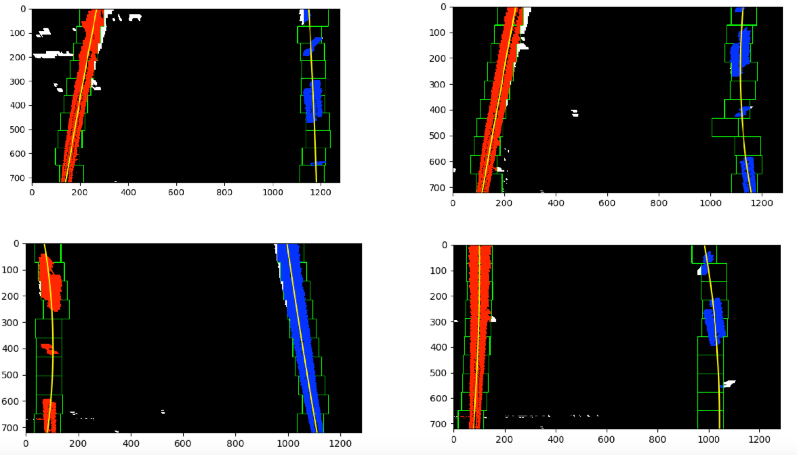
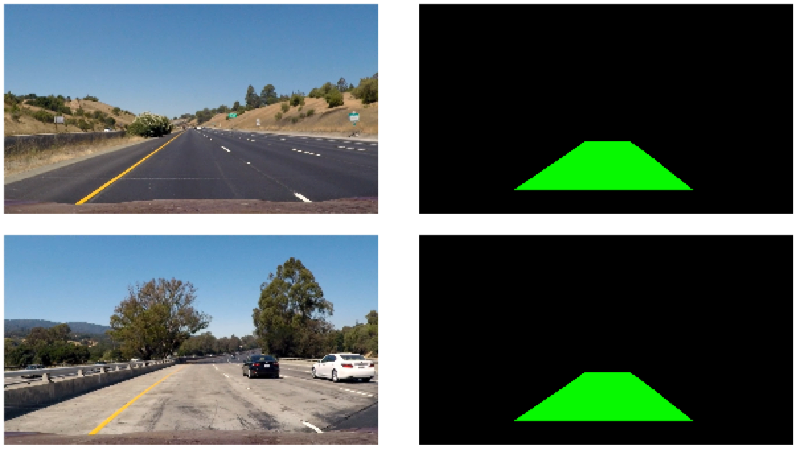
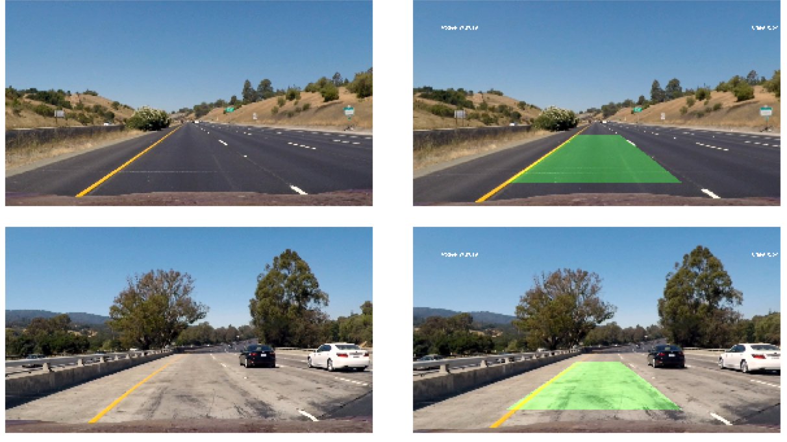

# Advanced Lane Finding

## Introduction

This repository contains code in Python to detect lane lines in a video using computer vision techniques. The input video is recorded by a camera placed under the car. This repository was submitted as a project for Udacity's Self Driving Car Nanodegree. For more information please visit - [Udacity's Self Driving Car Nanodegree](https://www.udacity.com/course/self-driving-car-engineer-nanodegree--nd013)

## Solution Overview

The following list is a step by step procedure of how the solution was acheived. The steps were repeated for each frame of the video to finally create the video output comprising of all the processed frames 

1. Calibrate the camera to to calculate the camera matrix calculations
2. Undistort the image using the camera matrix calculations
3. Apply various techniques to improve the visibility of the image.
4. Apply various techniques to identify valid pixels from the image.
5. Identify the region of interest based on the confidence of the previous detection.
6. Transform the Region of Interest's perspective to a bird's eye view
7. Detect the lane pixels using the window search method (more details below). During each of the windows if the lane pixels were detected the average pixel distance between the lane start points were stored. These values were later used if a lane is not confidently detected in order to approximate the position of the lane lines
8. Use the lane points to fit a linear equation which represents the lane lines
9. Draw an overlay over the lane lines and fill the polygon.
10. Transform the bird's eye overlay back to the original image
11. Calculate the radius of curvature using the linear equations and draw the value on the image
12. Calculate the offset from the center of the image by finding the center of the lanes and comparing with the actual centre of the image and draw on the image
13. Return the final processed image
 
 All of the above calculations were smoothed over a set of frames (in order to avoid jittering) and used. This includes the co-efficients of the linear equations, radius and offset value.
 
## Explanation

### Image Correction

The first step to a good solution is to fix the errors in the image. Errors or noise could be caused due to the camera distortion (more details [here](https://en.wikipedia.org/wiki/Distortion_(optics))), or weather/terrain/lighting conditions.
  
Camera calibration was done by using some pictures of a chessboard taken using the camera. Opencv's functions were used to calculate the distortion co-efficients and camera matrix like this - 

```
calibration.py

ln:66 # use the object and image points to get the required calculations
ln:67 ret, mtx, dist, rvecs, tvecs = cv2.calibrateCamera(objpoints, imgpoints, image_shape, None, None)
```

Here are some distorted images and the undistorted version - 


After undistortion, the image's visibility was improved by applying various techniques. The following techniques were used - 
1. Remove noise from the image by applying a Gaussian Blur. 
2. Improve brightness and contrast
3. Apply a gamma correction to improve the luminance. 

Opencv's functions were used for the implementation.
 
```
detector.py

ln:167  def __adjust_visibility(self, img, gain=1, bias=25):
            '''
            Method to increase the visibility of the image
            :param img: the image to process
            :param gain: multiplication factor
            :param bias: addition factor
            :return: the processed image
            '''
            return (img * gain) + bias

ln:177  def __remove_noise(self, img):
            '''
            Method to remove noise from the image by applying a Gaussian Blur
            :param img: the image to process
            :return: the processed image
            '''
            return cv2.GaussianBlur(img, (self.BLUR_KERNEL, self.BLUR_KERNEL), self.BLUR_SIGMA, self.BLUR_SIGMA)

ln:185  def __adjust_gamma(self, img, gamma=1.0):
            '''
            Method to adjust the gamma factor of the image
            :param img: the image to process
            :param gamma: gamma factor
            :return: the processed image
            '''
            invGamma = 1.0 / gamma
            table = np.array([((i / 255.0) ** invGamma) * 255
                              for i in np.arange(0, 256)]).astype("uint8")
    
            return cv2.LUT(img, table)
```
    
### Image Thresholding

The next part consists of removing all pixels that would not make up the lane lines. 
The following techniques were applied - 
1. Convert the image to the HLS color space to threshold the pixels based on the Saturation value
2. Apply the Sobel operator in the x direction to detect vertical lines and apply a threshold to select pixels
3. Apply the Sobel operator in the y direction to detect horizontal lines and apply a threshold to select pixels
4. Apply the Sobel in both the directions to detect magnitude and apply threshold to select pixels
5. Apply the Sobel in both the directions to detect direction and apply threshold to select pixels
  
The output of all the above thresholding steps were then used to eliminate pixels like this - 

```
detector.py

ln:219  # create the final image from the thresholded binaries
        final_image = np.zeros_like(img[:, :, 0])
        final_image[(((binary_x == 1) & (binary_y == 1)) | ((dir_binary == 1) & (mag_binary == 1))) | (color_bin == 1)] = 1
```

This is how the images look after pre-processing and thresholding



### Perspective Transform

The thresholded image was then transformed to a bird's eye perspective. The region of interest for the transformation was initially hardcoded by selecting four points from the first frame. This was then changed based on the confidence of the fits obtained. This ensured the right ROI was determined over a set of frames if the fits could not be confidently detected. 

```
detector.py

ln:300  def __predict_next_roi(self, conf):
            '''
            Method to set the next ROI based on the confidence of fits
            :param conf: the confidence value
            :return: the source and destination points
            '''
            conf = conf / (self.WINDOW_SLICE_COUNT + 1)
            if conf < self.ROI_MIN_CONFIDENCE:
                # print(conf)
                src, dest = self.__get_current_roi()
                src[0][0] = src[0][0] - (self.ROI_CHANGE)
                src[3][0] = src[3][0] - (self.ROI_CHANGE)
    
                src[1][0] = src[1][0] + (self.ROI_CHANGE)
                src[2][0] = src[2][0] + (self.ROI_CHANGE)
    
                self.__set_current_roi(src, dest)
    
            return self.__get_current_roi()
```

Here are some images that have been thresholded and warped - 



### Lane Detection

The warped images were then used to detect lane lines using the window search method. The window search method consists of sliding a small window over the estimated lane line position in both sides. If the window contained a minimum required count of pixels then the lane section was said to be determined confidently. The entire warped image was divided into a number of windows and the search was done for each of the window to detect the lane lines.

```
detector.py

ln:446  window_y_low = img.shape[0] - ((window + 1) * window_height)
        window_y_high = img.shape[0] - (window * window_height)
        window_xleft_low = leftx_current - self.WINDOW_MARGIN
        window_xleft_high = leftx_current + self.WINDOW_MARGIN
        window_xright_low = rightx_current - self.WINDOW_MARGIN
        window_xright_high = rightx_current + self.WINDOW_MARGIN
```

Every time a section was determined the average pixel distance at that window count was stored so that the next frames could search around that region. This was done in order to improve the detection of the lane lines.
  
  ```
  detector.py
  
  ln:435    if window in self.lane_distances:
                avg_px_dist = np.average(self.lane_distances[window], weights=self.lane_weights[window])
            else:
                avg_px_dist = -1
                
  ln:474    if not left_found:
                if right_found and avg_px_dist > 0:
                    leftx_current = np.int(rightx_current - avg_px_dist)
            if not right_found:
                if left_found and avg_px_dist > 0:
                    rightx_current = np.int(leftx_current + avg_px_dist)
  ```
  
The detected points were then used to fit two linear equations (left and right). The co-efficients of the linear equation was then averaged to provide a smooth fit over a set of frames. This final average fit was then used to process the final output.

These images show how the lanes were detected during the window search - 


 
The fit lines were calculated and a polygon was drawn and transformed -  
 


### Final Output

#### Overlay

The smooth fit lines were then used to fill a polygon on the warped image. The warped image was then converted to the original perspective based on the perspective matrix obtained from the ROI.
 
```
detector.py

ln:320  def __perspective_transform(self, img, mat):
            '''
            Method to transform the image
            :param img: the image to be transformed
            :param mat: the perspective matrix
            :return: the transformed image
            '''
            img_size = (img.shape[1], img.shape[0])
            warped = cv2.warpPerspective(img, mat, img_size, cv2.INTER_LINEAR)
    
            return warped
            
ln:528  ploty = np.linspace(0, warped.shape[0] - 1, warped.shape[0])
        left_fitx = (left_fit[0] * (ploty ** 2)) + (left_fit[1] * ploty) + (left_fit[2])
        right_fitx = (right_fit[0] * (ploty ** 2)) + (right_fit[1] * ploty) + (right_fit[2])
        pts_left = np.array([np.transpose(np.vstack([left_fitx, ploty]))])
        pts_right = np.array([np.flipud(np.transpose(np.vstack([right_fitx, ploty])))])
        pts = np.hstack((pts_left, pts_right))

        # Draw the lane onto the warped blank image
        cv2.fillPoly(color_warp, np.int_([pts]), (0, 255, 0))
        
        self.prev_overlay = self.__perspective_transform(color_warp, mat)
```

#### Radius of Curvature

The smooth fit lines were also used to calcuate the radius of curvature. Each pixel in the width was approximated to 3.7 metres and one pixel of height was approximated to 30 metres in the warped image. This data was then used to determine the line fits in real world space to calculate the radius of curvature.
```
detector.py

ln:546  def __get_radius(self, leftx, lefty, rightx, righty):
            '''
            Method to get the radius of curvature in meters
            :param leftx: the x points of the left lane
            :param lefty: the y points of the left lane
            :param rightx: the x points of the right lane
            :param righty: the y points of the right lane
            :return: the radius of curvature in meters
            '''
            ym_per_pix = 30 / 720  # 30 meters per pixel in y dimension
            xm_per_pix = 3.7 / 700  # 3.7 meters per pixel in x dimension
    
            # evaluate at the points near the car
            y_left_eval = np.max(lefty)
            y_right_eval = np.max(lefty)
    
            # Fit new polynomials to x,y in world space
            left_fit_cr = np.polyfit(lefty * ym_per_pix, leftx * xm_per_pix, 2)
            right_fit_cr = np.polyfit(righty * ym_per_pix, rightx * xm_per_pix, 2)
    
            # Calculate the new radius
            left_rad = ((1 + (2 * left_fit_cr[0] * y_left_eval * ym_per_pix + left_fit_cr[1]) ** 2) ** 1.5) / np.absolute(
                2 * left_fit_cr[0])
            right_rad = ((1 + (
                2 * right_fit_cr[0] * y_right_eval * ym_per_pix + right_fit_cr[1]) ** 2) ** 1.5) / np.absolute(
                2 * right_fit_cr[0])
    
            # return the left and right radius
            return np.round(left_rad, 2), np.round(right_rad, 2)
```

#### Offset from Center

The smooth fit lines were then used to find the centre point of the polygon's bottom. This was apprximated as the center point of the lane. The ideal center point should be the centre of the image assuming that the car was always in the centre of the lanes. This information was then used to determine the offset of the car from the center like this -
```
detector.py

ln:601  # calculate the actual center by getting the x values at the bottom
        leftx = (left_fit[0] * (self.image_height ** 2)) + (left_fit[1] * self.image_height) + (left_fit[2])
        rightx = (left_fit[0] * (self.image_height ** 2)) + (right_fit[1] * self.image_height) + (right_fit[2])
        self.offset_list.append(np.absolute((leftx - rightx) / 2))
        actual_center = np.average(self.offset_list)

        # caluclate offset from original in meters
        ideal_center = self.image_width / 2
        offset = np.round(np.absolute((actual_center - ideal_center) / 2) * 3.7 / 700, 2)
```

The above information was used to determined the final images.

And this is how the final output looks - 



The final processed video can be found in the repository as project_video_out.mp4

## Future Considerations

Though the model worked decently for the input video the following steps could be implemented to improve the result -
1. Implement an algorithm to remove shadows from the images
 2. Detect if the visibility of the image should be improved before increasing the brightness.

## Credits

1. Udacity's Self Driving Car Engineer Nanodegree team
2. Adrian Rosebrock for his wonderful Gamma Correction [example](http://www.pyimagesearch.com/2015/10/05/opencv-gamma-correction/) 
